## Lab
1. application kubernetes-api
2. Helm Chart
3. Deploy application with different values into dev/stage cluster
4. Try different sync mode
5. Update git repo(Helm/application)

### Create Repository
點選 Settings/Repositories 再透過 CONNECT REPO 建立要連線的資訊，建立內容如下


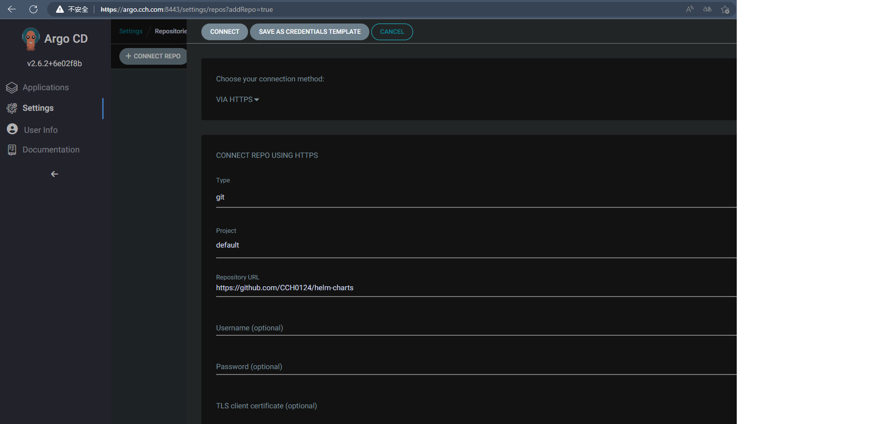

當中 `project`，選擇系統預設建立的 `default`。該物件負責做 RBAC 的應用功能。如下圖所示再 `settings/project` 下


再 Destinations 選項中可以針對 Cluster 和 namespece 進行設定。


### Create Application

點選 Application 頁籤，再點擊 NEW APP，即可建立一個 application

1. 定義 GENERAL
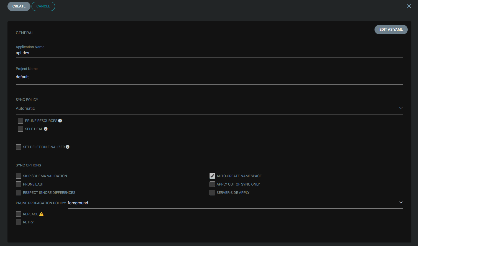

定義應用程式名稱這邊是 api-dev
Sync 策略選擇自動
Sync 選項勾選 `AUTOCREATE NAMESPACE`

2. 定義 Source 和 Destination

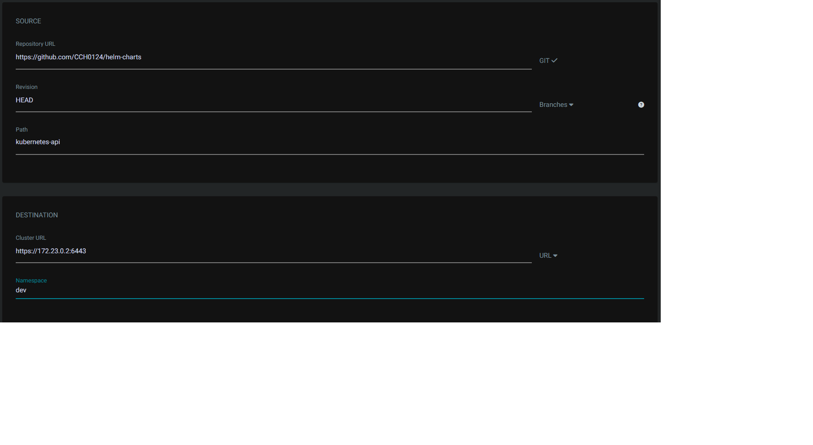

來源選擇一開始我們要監控的 Repo，`Revision` 選擇遠方 Repo 的分支，`Path` 遠方 Repo 的應用程式目錄，這邊所使用的會是該 Repo 下 `kubernete-api` 的 Helm Chart

接下去是佈署的目標這邊選擇 k3d 所建立的 dev 集群環境，namespace 這邊使用 `dev`

3. Helm

這邊沒意外事系統自行偵測，如下圖


當中 `VALUES FILES` 會自動偵測 Chart 中 values.yaml 這個檔案。下面都是參數的定義。

4. 建立

Helm 選項填入這些值
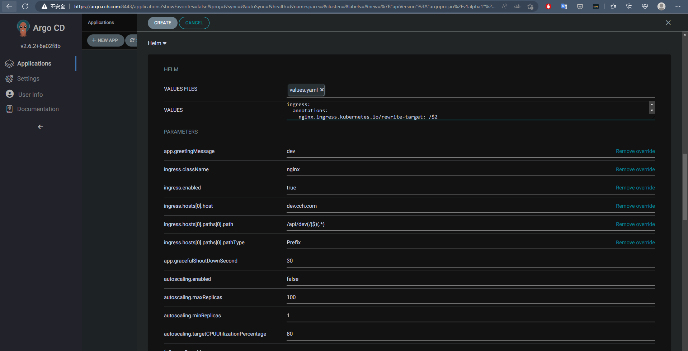

這邊必須說明一下，假設再 Helm Chart 定義了

```yaml
annotation: {}
```

這將不會再 `PARAMETRS` 出現，那我們將其定義再 `VALUES` 中，對 values.yaml 進行覆蓋。

這時畫面將會跳到 Application 的集合，如下

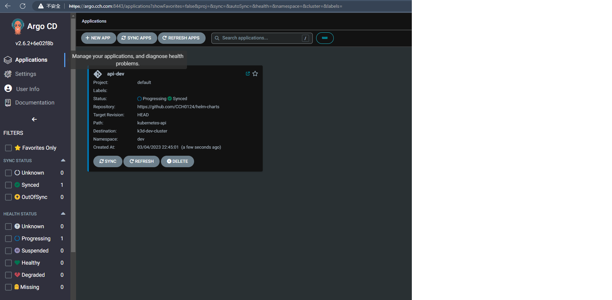

點擊該 App 會跳到更詳細的頁面，基本上是將佈署再 Cluster 上的 Kubernetes 資源列出

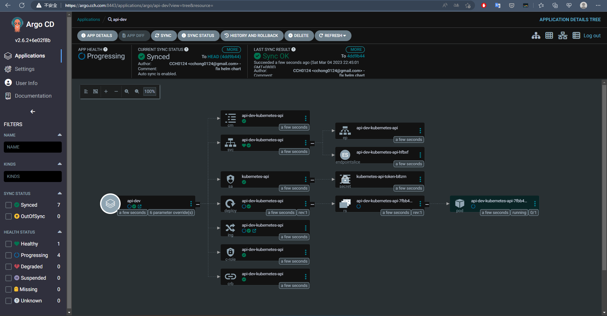

基本上上面流程都是 `AUTO SYNC` 的流程。

刪除剛剛所佈建的 `api-dev` app

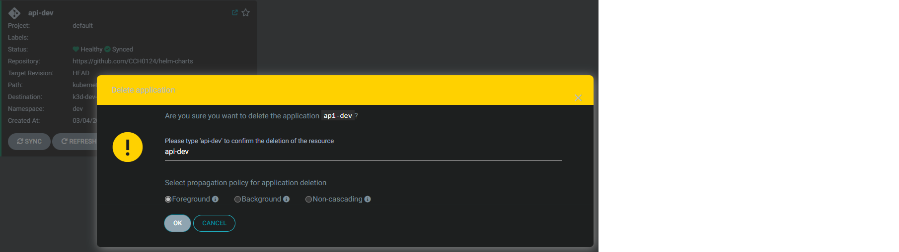

操作很直覺。

#### 手動 

將建立 APPLICATION 中 `GENERAL` 選項中的 `SYNC POLICY` 選擇 `Manual`。

這邊將環境布置到 stage 的集群中。

HELM 的 `VALUE FILE` 指向我們所同步的 Repo `env/values-stage.yaml`。

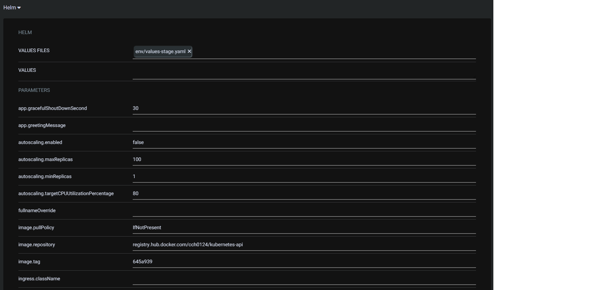

因為設定為手動，所以建立時是 `OUTOfSync` 狀態，但該 Application 是知道遠方有個 Repo。

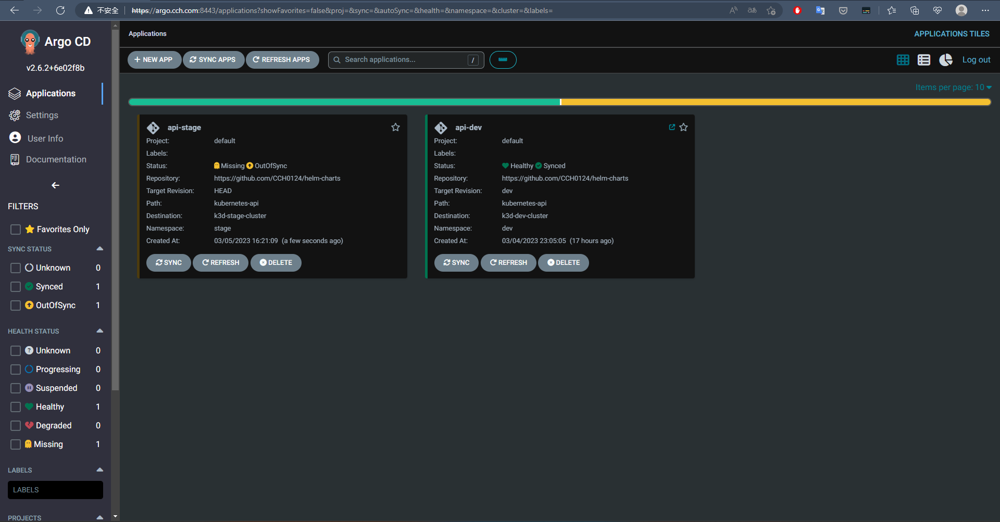

此時需要手動點擊 `Sync`，並跳出下圖右方頁籤接這再點擊頁籤的 `SYNCHRONIZE` 即可同步。


>SYNCHRONIZE RESOURCES 屬於選擇性同步，他不會被記錄在 `HISTORY AND ROLLBACK` 中


這邊我們再建立一個 prod 集群環境，並在 `SYNC POLICY` 選項中選擇 `Automatic` 和 `SELF HEAL` 自我修復。

### 應用程式其他應用功能

點擊 Applications 下 api-dev 應用程式再點擊 `APP DETAILS` 再選擇 `PARAMETERS`，可以看到詳細 Helm 的配置內容如下

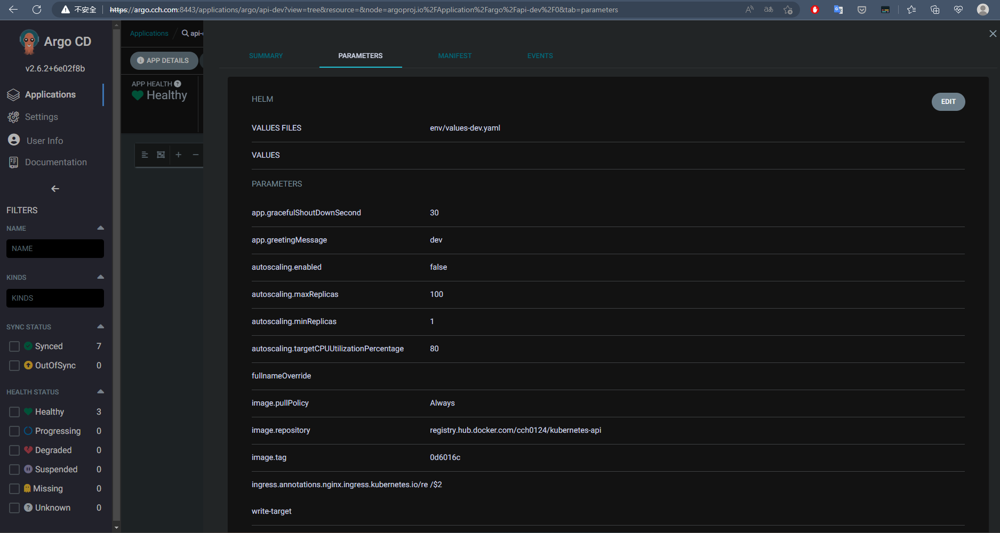

將應用程式佈署至 dev 集群的時候透過以下方式可以得到當前 API `/hello` 內容

```bash
$ curl http://dev.cch.com:8081/api/dev/hello
Hello dev
```

接著透過修改 `ingress.hosts[0].paths[0].path` 這個值，來看 ArgoCD 的處理。從上圖當前的狀態來看使用 `values-dev.yaml` 檔案進行佈署。藉由上圖中的 `EDIT` 即可來更新，將`ingress.hosts[0].paths[0].path` 值變成 `/api/test(/|$)(.*)`，並按下 `SAVE`，最後結果如下圖

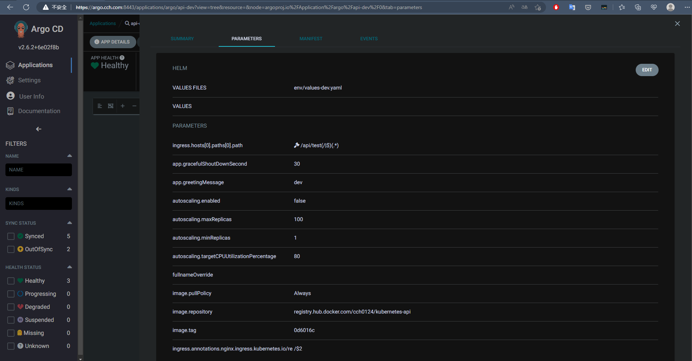

ArgoCD 上會有一個圖式表示那個值有被異動。

再透過 `curl` 測試執行

```bash
$ curl http://dev.cch.com:8081/api/dev/hello
<html>
<head><title>404 Not Found</title></head>
<body>
<center><h1>404 Not Found</h1></center>
<hr><center>nginx</center>
</body>
</html>
$ curl http://dev.cch.com:8081/api/test/hello
Hello dev
```

透過 `SYNC STATUS` 可以看到異動資訊，如下

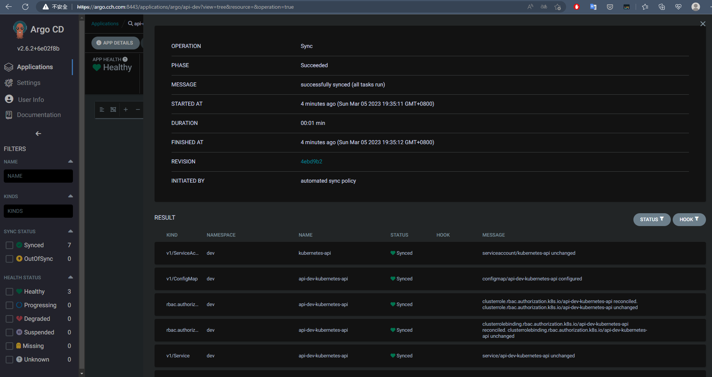

DURATION 什麼時間點前異動
INTIATED BY 誰做的，這邊是自動。如果是手動，那就會顯示是哪個登入者觸發。


### SELF HEAL

在 Dev 環境中，是沒有自我修復功能。我們嘗試將他的 POD 進行擴展。
```bash
$ kubectl config use-context k3d-dev-cluster
$ kubectl -n dev scale deployment api-dev-kubernetes-api --replicas=2
deployment.apps/api-dev-kubernetes-api scaled
```

從 ArgoCD 界面來看它變成兩個了

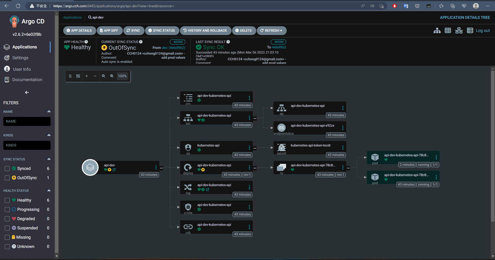

此時的 `Deployment` 資源是 `OutOfSync` 狀態，也表示它有異動。可以嘗試點籍 `deploy` 的資源，其訊息如下

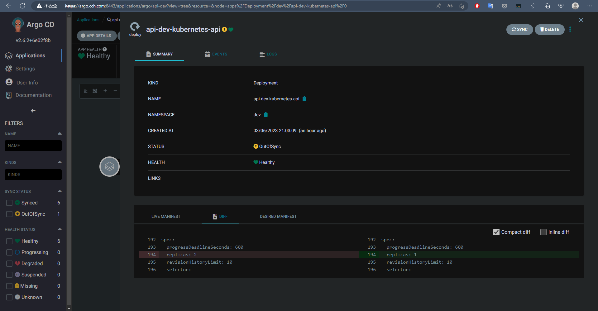

透過 `LIVE MANIFEST` 可以知道當前狀態；`DESIRED MANIFEST` 是原先佈署時期望狀態。而 `DIFF` 可以查看出現行和期望狀態的差異，而這邊範例是 `replicas` 數量。最後可以透過 `SYNC` 再同步回來。

前面再 Prod 環境中有開啟此自動修復功能，目前 Prod 所佈署的內容為 1 個副本，此時我們遠端操作該 Prod 所佈署的 `Deployment` 資源。
```bash
$ kubectl config use-context k3d-prod-cluster
$ kubectl -n prod scale deployment api-prod-kubernetes-api --replicas=2
deployment.apps/api-prod-kubernetes-api scaled
```
此時這邊環境並無任何異動，如果觀察 `DIFF` 會是空值，表示沒有被異動。就算非正常流程異動，ArgoCD 能夠透過自動修復來完成他所期望的狀態。


上述是變更 Kubernetes 狀態，非 yaml。


### Auto sync from commit

再 dev 環境，我們是使用 `dev` 分支做自動同步，這邊我們嘗試做一個 `commit`。

修改 [Repo](https://github.com/CCH0124/helm-charts/blob/dev/kubernetes-api/env/values-dev.yaml) 位置。
```yaml
image:
  tag: "0d6016c"
  pullPolicy: Always
replicaCount: 2 # 1 變成 2
rbac:
  create: true  
app:
  greetingMessage: "dev-change" # dev 變成 dev-change
ingress:
  enabled: true
  className: "nginx"
  annotations: 
    nginx.ingress.kubernetes.io/rewrite-target: /$2
  hosts:
    - host: dev.cch.com
      paths:
        - path: /api/dev(/|$)(.*)
          pathType: Prefix
```

沒多久後，ArgoCD 中 `api-dev` 應用程式做了同步更新，如下圖

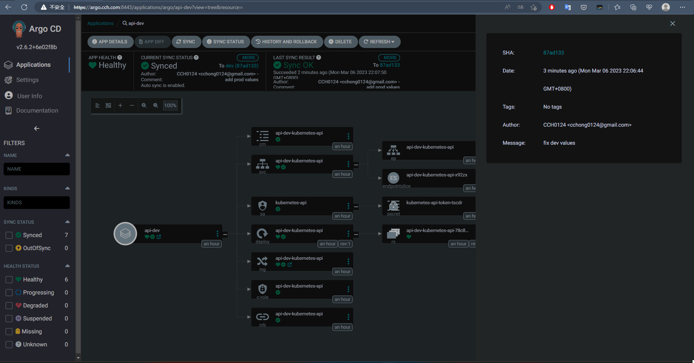

這邊可以從 `LAST SYNC RESULT` 選項看到它同步成功訊息，並且在 `MORE` 可以看到誰 `commit`。最後使用 curl 驗證

```bash
$ curl http://dev.cch.com:8081/api/dev/hello
Hello dev-change # 確實被更改了
```

注意這邊 prod 環境同樣是監聽 `dev` 分支但剛才的異動是不會影響的。看起來是會看我們綁定的 `VALUES FILE`。

透過 `HISTORY AND ROLLBACK` 選項可以看到過去的異動紀錄，如下圖。

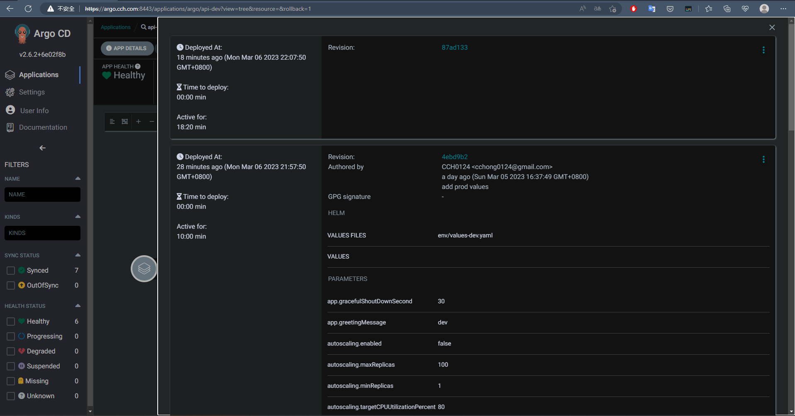