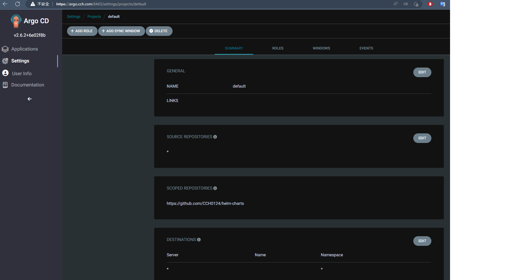

## Lab
1. application kubernetes-api
2. Helm Chart
3. Deploy application with different values into dev/stage cluster
4. Try different sync mode
5. Update git repo(Helm/application)

### Create Repository
點選 Settings/Repositories 再透過 CONNECT REPO 建立要連線的資訊，建立內容如下


當中 `project`，選擇系統預設建立的 `default`。該物件負責做 RBAC 的應用功能。如下圖所示再 `settings/project` 下



再 Destinations 選項中可以針對 Cluster 和 namespece 進行設定。


### Create Application

點選 Application 頁籤，再點擊 NEW APP，即可建立一個 application

1. 定義 GENERAL


定義應用程式名稱這邊是 api-dev
Sync 策略選擇自動
Sync 選項勾選 `AUTOCREATE NAMESPACE`

2. 定義 Source 和 Destination


來源選擇一開始我們要監控的 Repo，`Revision` 選擇遠方 Repo 的分支，`Path` 遠方 Repo 的應用程式目錄，這邊所使用的會是該 Repo 下 `kubernete-api` 的 Helm Chart

接下去是佈署的目標這邊選擇 k3d 所建立的 dev 集群環境，namespace 這邊使用 `dev`

3. Helm

這邊沒意外事系統自行偵測，如下圖


當中 `VALUES FILES` 會自動偵測 Chart 中 values.yaml 這個檔案。下面都是參數的定義。

4. 建立

Helm 選項填入這些值


這邊必須說明一下，假設再 Helm Chart 定義了

```yaml
annotation: {}
```

這將不會再 `PARAMETRS` 出現，那我們將其定義再 `VALUES` 中，對 values.yaml 進行覆蓋。

這時畫面將會跳到 Application 的集合，如下


點擊該 App 會跳到更詳細的頁面，基本上是將佈署再 Cluster 上的 Kubernetes 資源列出


基本上上面流程都是 `AUTO SYNC` 的流程。

刪除剛剛所佈建的 `api-dev` app


操作很直覺。