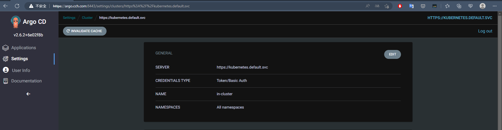

## 架設 Argo

預設管理的 Cluster 是自己


會讀取我們預設 Kubernetes 的 Service 服務
```bash
$ kubectl get svc
NAME         TYPE        CLUSTER-IP   EXTERNAL-IP   PORT(S)   AGE
kubernetes   ClusterIP   10.43.0.1    <none>        443/TCP   3h6m
```

對於新增 Cluster 要使用 Cli 方式操作。

## Install Argo cli

```bash
 wget https://github.com/argoproj/argo-cd/releases/download/v2.6.2/argocd-linux-amd64
 sudo mv argocd-linux-amd64 /usr/local/bin/argocd
 sudo chmod +x /usr/local/bin/argocd
```

安裝完上述後，接著 login 

```bash
$ argocd login argo.cch.com:8443
WARNING: server certificate had error: x509: certificate is valid for ingress.local, not argo.cch.com. Proceed insecurely (y/n)?
WARNING: server certificate had error: x509: certificate is valid for ingress.local, not argo.cch.com. Proceed insecurely (y/n)? y
WARN[0012] Failed to invoke grpc call. Use flag --grpc-web in grpc calls. To avoid this warning message, use flag --grpc-web.
Username: admin
Password:
'admin:login' logged in successfully
Context 'argo.cch.com:8443' updated
```

`Password` 使用預設 argocd 創建的。

透過以下指令可以觀看目前管理的群集和當前使用的群集
```bash
$ argocd context
CURRENT  NAME               SERVER
*        argo.cch.com:8443  argo.cch.com:8443
$ argocd cluster list
WARN[0000] Failed to invoke grpc call. Use flag --grpc-web in grpc calls. To avoid this warning message, use flag --grpc-web.
SERVER                          NAME        VERSION  STATUS   MESSAGE                                                  PROJECT
https://kubernetes.default.svc  in-cluster           Unknown  Cluster has no applications and is not being monitored.
```

## 管理多個 Cluster
