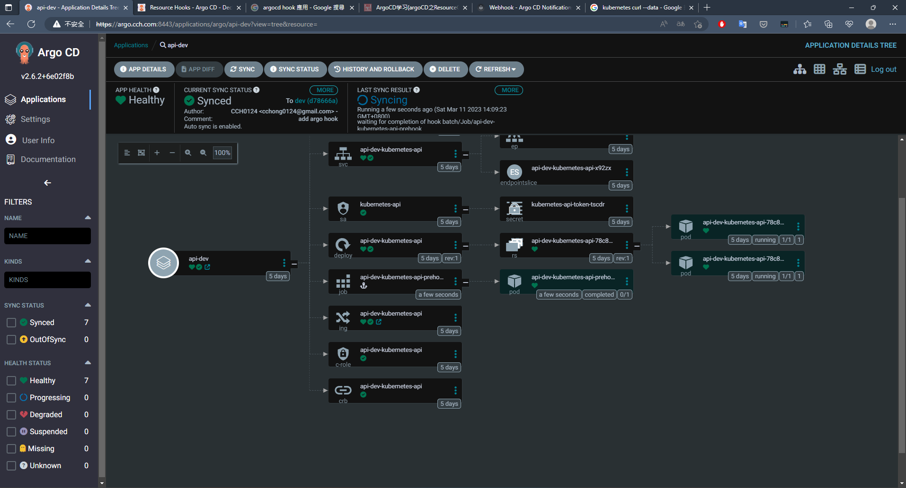
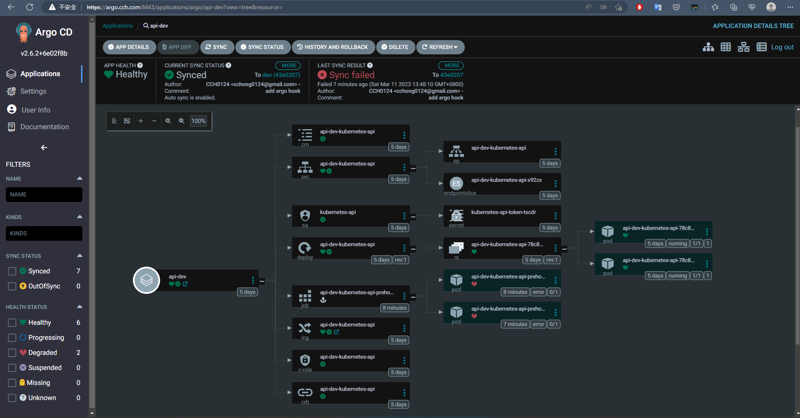

## Lab2
1. 使用 Sync Hook
2. 使用此 [Repo](https://github.com/CCH0124/helm-charts/tree/master/kubernetes-api) 的 Helm Chart
4. 驗證
### [Sync Hook](https://argo-cd.readthedocs.io/en/stable/user-guide/resource_hooks/)
官方至當前 2.6 版本定義了以下
- PreSync
  - Executes prior to the application of the manifests.
  - 在應用清單同步之前執行
- Sync
  - Executes after all PreSync hooks completed and were successful, at the same time as the application of the manifests.
  - 在所有 PreSync 掛鉤完成並成功後執行，同時執行應用清單
- Skip
  - Indicates to Argo CD to skip the application of the manifest.
- PostSync
  - Executes after all Sync hooks completed and were successful, a successful application, and all resources in a Healthy state.
  - 在所有 Sync 掛鉤完成並成功、成功的應用程式以及所有資源處於健康狀態後執行
- SyncFail
  - Executes when the sync operation fails. Available starting in v1.2

掛鉤可以是任何類型的 Kubernetes 資源類型，通常是 Pod、Job 或 Argo Workflows

這邊簡單使用 `PreSync` 或是 `PostSync` 完成。


**Hook Deletion Policies**

官方至當前 2.6 版本定義了以下
- HookSucceeded
- HookFailed
- BeforeHookCreation


這邊寫了一個 wehook API，如下運行

```bash
$ docker run -itd --name webhook -p 9090:8080 cch0124/webhook:43dbc06
```

同時將 Helm Chart 中 `env/values-dev` 新增這兩個參數

```yaml
hook:
  create: true
  endpoint: http://172.18.144.71:9090/webhook
```

接者等待 ArgoCD 自行對 `api-dev` 同步或是手動 `SYNC`，最後該 `webhook` 容器會有以下訊息


```bash
2023-03-11 06:09:21,033 INFO  [com.cch.WebhookResource] (executor-thread-0)  {} 
2023-03-11 06:09:21,033 INFO  [com.cch.WebhookResource] (executor-thread-0) ===================================================
hook: pre-hook
2023-03-11 06:09:21,033 INFO  [com.cch.WebhookResource] (executor-thread-0) ===================================================
2023-03-11 06:09:28,439 INFO  [com.cch.WebhookResource] (executor-thread-0)  {} 
2023-03-11 06:09:28,439 INFO  [com.cch.WebhookResource] (executor-thread-0) ===================================================
hook: post-hook
2023-03-11 06:09:28,439 INFO  [com.cch.WebhookResource] (executor-thread-0) ===================================================
```


因為他是一瞬間的事情所以，成功會如下接者透過我們給的 Hook 刪除策略，直接刪除。




這邊有一個失敗的截圖，因為 curl 的參數放置 `command` 中有錯誤。因為 Hook 刪除策略，沒有設定 `HookFailed`，所以不會被刪除




看 Helm Chart 中的 hook 設計

```yaml
{{ if eq .Values.hook.create true }}
{{- $hookEndpoint := .Values.hook.endpoint -}}
{{- $fullName :=include "kubernetes-api.fullname" . -}}
---
apiVersion: batch/v1
kind: Job
metadata:
  name: {{ $fullName }}-prehook
  annotations:
    argocd.argoproj.io/hook: PreSync # 觸發 Hook 時機
    argocd.argoproj.io/hook-delete-policy: HookSucceeded # 定義策略
spec:
  template:
    spec:
      containers:
      - name: prehook-example
        image: curlimages/curl
        command:
          - "curl"
          - "-X"
          - "POST"
          - "-H"
          - "Accept: application/json"
          - "-H"
          - "Content-Type: application/json"
          - "--data"
          - '{"hook": "pre-hook"}'
          - {{ $hookEndpoint }}
      restartPolicy: Never
  backoffLimit: 1
---
apiVersion: batch/v1
kind: Job
metadata:
  name: {{ $fullName }}-posthook
  annotations:
    argocd.argoproj.io/hook: PostSync
    argocd.argoproj.io/hook-delete-policy: HookSucceeded
spec:
  template:
    spec:
      containers:
      - name: posthook-example
        image: curlimages/curl
        command:
          - "curl"
          - "-X"
          - "POST"
          - "-H"
          - "Accept: application/json"
          - "-H"
          - "Content-Type: application/json"
          - "--data"
          - '{"hook": "post-hook"}'
          - {{ $hookEndpoint }}
      restartPolicy: Never
  backoffLimit: 1
{{ end }}

```
