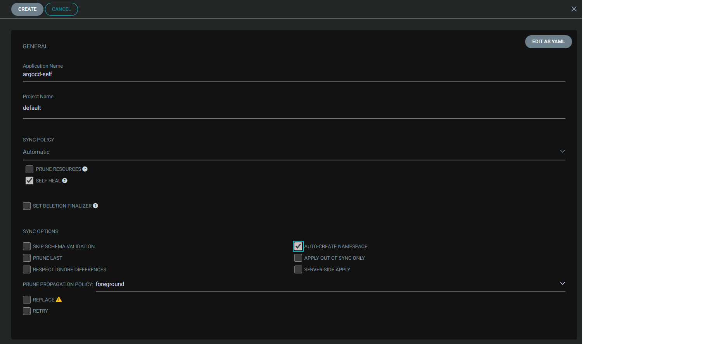
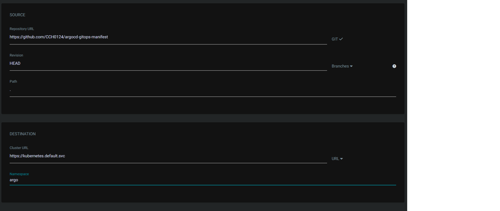
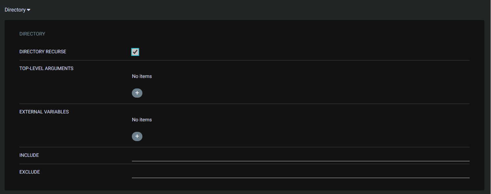
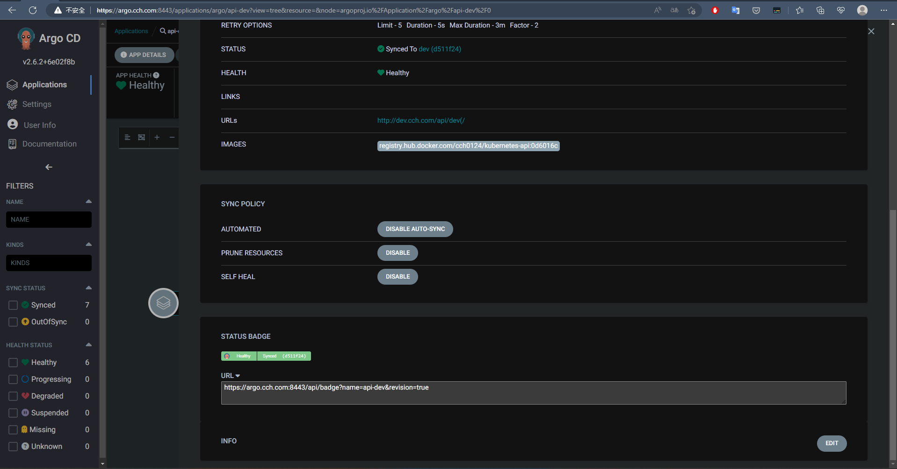

## Declarative ArgoCD

實作 [Repo](https://github.com/CCH0124/argocd-gitops-manifest)，該一開始要將此 Repo 加至 ArgoCD 中的 `Repositories`。接著建立其 Application 針對 `argocd-gitops-manifest` Repo，建立如下圖

最後 Application，幫我們建立了我們定義的 application 像是 ArgoCD 自己這邊使用了 [Helm Chart 方式](https://github.com/CCH0124/argocd-gitops-manifest/blob/master/argocd/argocd.yaml)還有 [dev 環境](https://github.com/CCH0124/argocd-gitops-manifest/blob/master/application/dev.yaml)。比較特別的是我們啟用了 `statusbadge.enabled: "true"` 在 App 的詳細內容中會多了下圖中的 `STATUS BADGE`

使用 applicationSet 概念來佈署物件，場景可以應用於要對多個 Cluster 佈署 promethues 物件等。相當於用一個 for loop 概念完成對多個集群佈署。這邊範例可以看[我寫的](https://github.com/CCH0124/argocd-gitops-manifest/blob/master/application-set/stage-prod.yaml)使用一個 Helm Chart 對不同的集群做同樣的佈署，那詳細應用可以參考[官方](https://argo-cd.readthedocs.io/en/stable/operator-manual/applicationset/)。

