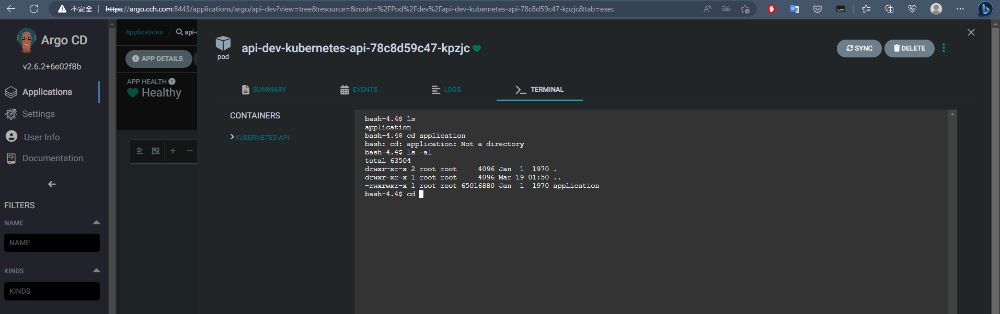

## RBAC and User
1. Create Project
2. Create User
3. Create RBAC Plicy
4. Verify the Users
5. Update the Users Password

## Create Project
建立 Project 可以如下建置
```yaml
apiVersion: argoproj.io/v1alpha1
kind: AppProject
metadata:
  name: dev-project
  namespace: argo
  # Finalizer that ensures that project is not deleted until it is not referenced by any application
  finalizers:
    - resources-finalizer.argocd.argoproj.io
spec:
  description: dev Project
  # Allow manifests to deploy from any Git repos
  sourceRepos:
  - https://github.com/CCH0124/helm-charts
  # Only permit applications to deploy to the guestbook namespace in the same cluster
  destinations:
  - namespace: dev
    server: https://172.23.0.7:6443
```
## User and RBAC

這邊使用 Helm Chart 佈署，因此我們可以如下進行設定 User 和 RBAC 部分

```
        configs:
          cm:
            ...
            exec.enabled: true
            exec.shells: "bash,sh,powershell,cmd"
            accounts.devuser: login
            accounts.pmuser: login
            accounts.opsuser: login
          rbac:
            create: true
            policy.default: role:''
            policy.csv: |
                p, role:dev, applications, *,  dev-project/*, allow
                p, role:dev, projects, get,  dev-project, allow
                p, role:dev, repositories, get,  *, allow
                p, role:dev, clusters, get,  *, allow
                g, devuser, role:dev
                
                p, role:pm, applications, get,  */*, allow
                p, role:pm, projects, get,  *, allow
                p, role:pm, repositories, get,  *, allow
                p, role:pm, clusters, get,  *, allow
                g, pmuser, role:pm

                p, role:op, applications, *,  */*, allow
                p, role:op, projects, *,  *, allow
                p, role:op, repositories, *,  *, allow
                p, role:op, clusters, *,  *, allow
                p, role:op, accounts, *,  *, allow
                p, role:op, certificates, *,  *, allow
                p, role:op, gpgkeys, *,  *, allow
                p, role:op, exec, create, */*, allow
                g, opsuser, role:op

```

詳細資訊可參考[官方](https://argo-cd.readthedocs.io/en/stable/operator-manual/rbac/)

### Verify the Users
```
$ argocd login argo.cch.com:8443
WARNING: server certificate had error: x509: certificate is valid for ingress.local, not argo.cch.com. Proceed insecurely (y/n)? y
WARN[0002] Failed to invoke grpc call. Use flag --grpc-web in grpc calls. To avoid this warning message, use flag --grpc-web.
Username: admin
Password:
'admin:login' logged in successfully
Context 'argo.cch.com:8443' updated
$ argocd account list
WARN[0000] Failed to invoke grpc call. Use flag --grpc-web in grpc calls. To avoid this warning message, use flag --grpc-web.
NAME     ENABLED  CAPABILITIES
admin    true     login
devuser  true     login
opsuser  true     login
pmuser   true     login
```

### Update the Users Password

Format

```bash
argocd account update-password --account <new-username> --new-password <new-password>
```
```bash
$ argocd account update-password --account devuser --new-password a12345678
```


### Verify devuser
對於 devuser 其權限如下

```yaml
p, role:dev, applications, *,  dev-project/*, allow
p, role:dev, projects, get,  dev-project, allow
p, role:dev, repositories, get,  *, allow
p, role:dev, clusters, get,  *, allow
g, devuser, role:dev
```

對於 dev-project/* 下的 Application 都可以進行操作但被限制於 `dev-project` 下；但對於 projects、repositories、clusters 都只能獲取，不能夠新增或更新。這邊對於應用程式佈署我們限制於 `dev-project` 同時只有 dev 叢集能佈署，只要是其它叢集都會被拒絕。

對於 pmuser 可以看到資源，但基本沒權限建立像是 projects、repositories、clusters 等。

對於 opsuser 在配置上多了，`exec` 選項在權限上只有賦予 opsuser 能夠有這個選項。如下圖

