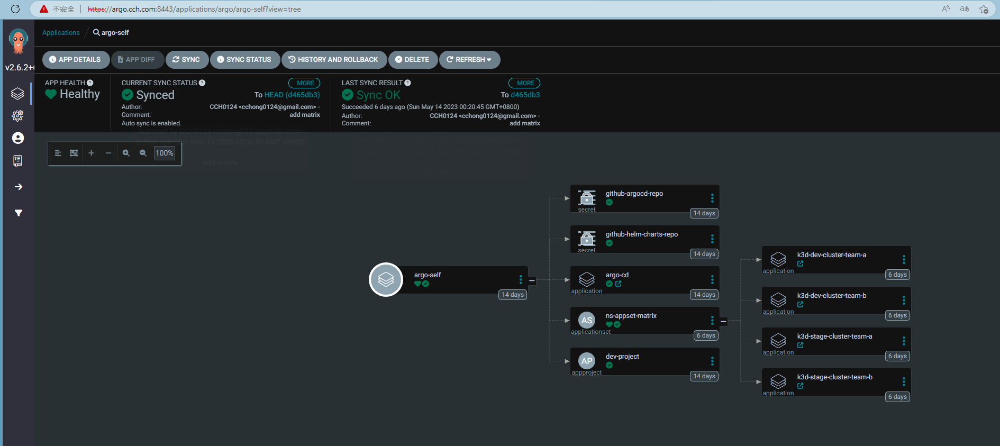

## ApplicationSet

`ApplicationSet` 是一個 CRD，他將 Argocd 中 Application 資源做到自動化以及靈活性，對於多租戶上它帶來自動化是更為方便。

`ApplicationSet` 提供以下

- 透過 ArgoCD 使用單一個資源，對多個 Kubernetes 集群做同一件事的定位
- 使用單一資源透過 ArgoCD 從一個或多個 Git 儲存庫部署多個應用程式
- 在 ArgoCD 的上下文中，monorepo 是在單個 Git 儲存庫中定義的多個 ArgoCD 應用程式資源
- 在多租戶集群中，提高單個集群租戶使用 ArgoCD 部署應用程式的能力，無需讓特權集群管理員參與啟用目標集群/命名空間

一個 `ApplicastionSet` 是透過 `generators` 來產生參數並對 `template` 進行渲染。其 `matrix` 有以下資源
- List
- Cluster
- Git 
- Matrix
- Merge
- Pull Request
- etc.

那詳細介紹可以查看[官方](https://argo-cd.readthedocs.io/en/stable/operator-manual/applicationset/Generators/)

以下是一個範例，目標是在 dev 和 stage 的 Kubernetes 集群上將兩個 team 進行 namespace 的資源限制。這邊用到 `matrix` 的概念來實作。
```yaml
apiVersion: argoproj.io/v1alpha1
kind: ApplicationSet
metadata:
  name: ns-appset-matrix
  namespace: argo
spec:
  generators:
    - matrix:
        generators:
          - clusters:
              selector:
                matchExpressions:
                  - key: env
                    operator: In
                    values:
                      - dev
                      - stage
              values: # 定義額外的變數
                revision: argo-appset
                clusterName: '{{name}}' # name 會來自 secrets 中定義 cluster 的欄位 
          - list: # 定義一系列的變數，這邊就是以 team 為一個範例
              elements:
                - template: team-a
                - template: team-b
  template:
    metadata:
      name: '{{values.clusterName}}-{{template}}'
    spec:
      project: default
      source:
        repoURL:  https://github.com/CCH0124/helm-charts
        targetRevision: '{{values.revision}}'
        path: 'kustomizes/namespace-config/overlays/{{values.clusterName}}/{{template}}'
      destination:
        server: '{{server}}'
        namespace: '{{template}}'
      syncPolicy:
        automated:
          prune: true
          selfHeal: true
        syncOptions:
        - CreateNamespace=true
```

這個模板定義後效果如下圖



未來只要新增一個團隊至 list 下的 elements 時，dev 和 stage 環境都會被加上對於該 team 的 namespace 資源限制。


```yaml
# secrets 中定義的 cluster 
$ kubectl  get secrets -n argo
NAME                                           TYPE                                  DATA   AGE
...
cluster-172.18.0.7-1431263391                  Opaque                                3      14d
cluster-172.18.0.10-2339052749                 Opaque                                3      14d
cluster-172.18.0.13-562428686
$ kubectl  describe secrets cluster-172.18.0.10-2339052749 -n argo
Name:         cluster-172.18.0.10-2339052749
Namespace:    argo
Labels:       argocd.argoproj.io/secret-type=cluster
              env=stage
Annotations:  managed-by: argocd.argoproj.io

Type:  Opaque

Data
====
config:  2701 bytes
name:    17 bytes
server:  24 bytes
```


**REF:**
- https://medium.com/@mprzygrodzki/argocd-applicationsset-with-helm-72bb6362d494
- https://cloud.redhat.com/blog/configuring-openshift-cluster-with-applicationsets-using-helmkustomize-and-acm-policies
- https://kubebyexample.com/learning-paths/argo-cd/argo-cd-working-kustomize
