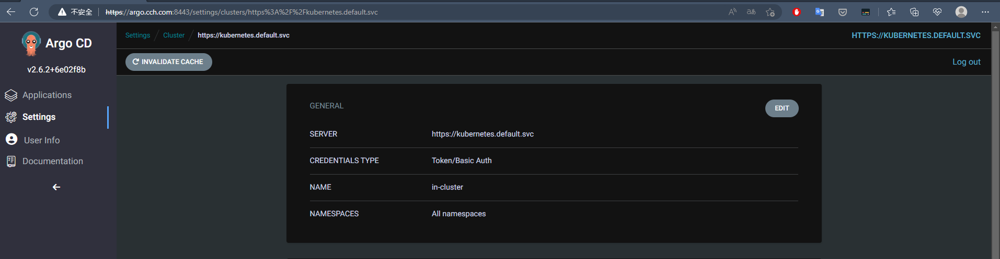
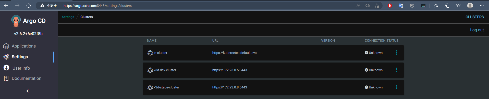
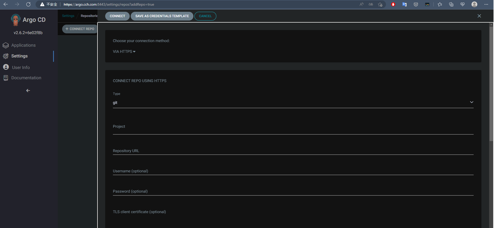

## 架設 Argo

預設管理的 Cluster 是自己


會讀取我們預設 Kubernetes 的 Service 服務
```bash
$ kubectl get svc
NAME         TYPE        CLUSTER-IP   EXTERNAL-IP   PORT(S)   AGE
kubernetes   ClusterIP   10.43.0.1    <none>        443/TCP   3h6m
```

對於新增 Cluster 要使用 Cli 方式操作。

## Install Argo cli

```bash
 wget https://github.com/argoproj/argo-cd/releases/download/v2.6.2/argocd-linux-amd64
 sudo mv argocd-linux-amd64 /usr/local/bin/argocd
 sudo chmod +x /usr/local/bin/argocd
```

安裝完上述後，接著 login 

```bash
$ argocd login argo.cch.com:8443
WARNING: server certificate had error: x509: certificate is valid for ingress.local, not argo.cch.com. Proceed insecurely (y/n)?
WARNING: server certificate had error: x509: certificate is valid for ingress.local, not argo.cch.com. Proceed insecurely (y/n)? y
WARN[0012] Failed to invoke grpc call. Use flag --grpc-web in grpc calls. To avoid this warning message, use flag --grpc-web.
Username: admin
Password:
'admin:login' logged in successfully
Context 'argo.cch.com:8443' updated
```

`Password` 使用預設 argocd 創建的。

透過以下指令可以觀看目前管理的群集和當前使用的群集
```bash
$ argocd context
CURRENT  NAME               SERVER
*        argo.cch.com:8443  argo.cch.com:8443
$ argocd cluster list
WARN[0000] Failed to invoke grpc call. Use flag --grpc-web in grpc calls. To avoid this warning message, use flag --grpc-web.
SERVER                          NAME        VERSION  STATUS   MESSAGE                                                  PROJECT
https://kubernetes.default.svc  in-cluster           Unknown  Cluster has no applications and is not being monitored.
```
## 變更密碼

```bash
$ argocd account update-password
WARN[0000] Failed to invoke grpc call. Use flag --grpc-web in grpc calls. To avoid this warning message, use flag --grpc-web.
*** Enter password of currently logged in user (admin):
*** Enter new password for user admin:
*** Confirm new password for user admin:
Password updated
Context 'argo.cch.com:8443' updated
```
## 管理多個 Cluster
對於 Argo 要管理多個 Kubernetes 來說，會需要 `KUBECONFIG` 來對集群進行管理。

```bash
$ kubectl config get-contexts
CURRENT   NAME                                                                  CLUSTER                                                               AUTHINFO                                                              NAMESPACE
*         k3d-argo-cluster                                                      k3d-argo-cluster                                                      admin@k3d-argo-cluster
          k3d-dev-cluster                                                       k3d-dev-cluster                                                       admin@k3d-dev-cluster
          k3d-quarkus-cluster                                                   k3d-quarkus-cluster                                                   admin@k3d-quarkus-cluster
          k3d-stage-cluster                                                     k3d-stage-cluster                                                     admin@k3d-stage-cluster
```

那對於每個 K3d 所建立出來對集群的連線是由一些複雜網路技巧所組成，因此預設下無法透過 KUBECONFIG 內的連線位置進行存取。需透過容器中 IP。**這邊讓 K3d 建立的集群都共用同一個 docker 建立的網路**。

```bash
// 對於 k3d-dev-cluster 他的 IP 位置是 172.23.0.5
$ docker exec k3d-dev-cluster-server-0 ifconfig eth0
eth0      Link encap:Ethernet  HWaddr 02:42:AC:17:00:05  
          inet addr:172.23.0.5  Bcast:172.23.255.255  Mask:255.255.0.0
          UP BROADCAST RUNNING MULTICAST  MTU:1500  Metric:1
          RX packets:2723 errors:0 dropped:0 overruns:0 frame:0
          TX packets:2796 errors:0 dropped:0 overruns:0 carrier:0
          collisions:0 txqueuelen:0 
          RX bytes:449011 (438.4 KiB)  TX bytes:1316002 (1.2 MiB)
```

需修改 KUBECONFIG 內容如下

```
$ vi .kube/config

....
server: https://dev.cch.com:6446 # 替換成 172.23.0.5:6443
...
```

對於 Stage 和 Prod 環境也是如此替換。

替換完成後即可透過 argocd cli 方式加入集群

```bash
~/gitops/k3d$ argocd cluster add k3d-dev-cluster 
WARNING: This will create a service account `argocd-manager` on the cluster referenced by context `k3d-dev-cluster` with full cluster level privileges. Do you want to continue [y/N]? y
INFO[0001] ServiceAccount "argocd-manager" already exists in namespace "kube-system" 
INFO[0001] ClusterRole "argocd-manager-role" updated    
INFO[0001] ClusterRoleBinding "argocd-manager-role-binding" updated 
WARN[0001] Failed to invoke grpc call. Use flag --grpc-web in grpc calls. To avoid this warning message, use flag --grpc-web. 
Cluster 'https://172.23.0.5:6443' added
~/gitops/k3d$ argocd cluster add k3d-stage-cluster
WARNING: This will create a service account `argocd-manager` on the cluster referenced by context `k3d-stage-cluster` with full cluster level privileges. Do you want to continue [y/N]? y
INFO[0001] ServiceAccount "argocd-manager" created in namespace "kube-system" 
INFO[0001] ClusterRole "argocd-manager-role" created    
INFO[0001] ClusterRoleBinding "argocd-manager-role-binding" created 
WARN[0002] Failed to invoke grpc call. Use flag --grpc-web in grpc calls. To avoid this warning message, use flag --grpc-web. 
Cluster 'https://172.23.0.8:6443' added
```

GUI 查看



Cli

```bash
$ argocd cluster list
WARN[0000] Failed to invoke grpc call. Use flag --grpc-web in grpc calls. To avoid this warning message, use flag --grpc-web. 
SERVER                          NAME               VERSION  STATUS   MESSAGE                                                  PROJECT
https://172.23.0.5:6443         k3d-dev-cluster             Unknown  Cluster has no applications and is not being monitored.  
https://172.23.0.8:6443         k3d-stage-cluster           Unknown  Cluster has no applications and is not being monitored.  
https://kubernetes.default.svc  in-cluster                  Unknown  Cluster has no applications and is not being monitored.
```

>移除使用 argocd cluster rm [SERVER_NAME]

## Operations

在 gitops 中，會希望比對遠方的物件(Helm Chart、yaml...)，那這些物件會儲存在版控系統中。因此 Argo 有以下概念

- Repositories
  - 目標同步的位置
- Project
  - 邏輯上對應用程式分群
  - RBAC 使用者可以做哪些事情

### Repositories

在 Argo 介面中可以看到如下



- Type
  - Git
  - Helm
- URL
- Username
- Password
- TLS 

### Application
當有了 `Repositories` 接著就是告訴 Argo 要部署應用程式。而應用程式由以下組成

- General
  - Name
  - Project
  - Sync Policy
- Source
  - Repository
  - Revision
    - Branch/Tag
  - Path
- Destination
  - Cluster Url
  - namespace

### [Automated Sync Policy](https://argo-cd.readthedocs.io/en/stable/user-guide/auto_sync/)
- Polled every 3 mins
- Automatic pruning
- Automatic Self-Healing
- Repo Server
- Automated Sync Semantics

### [Sync Options](https://argo-cd.readthedocs.io/en/stable/user-guide/sync-options/)
- Prune
- Dry-run
- Apply Only
  - Skip pre/post sync hooks
- Force

### [Sync Hook](https://argo-cd.readthedocs.io/en/stable/user-guide/resource_hooks/)

- PreSync
  - DB schema migration
- Sync
- Skip
- PostSync
- SyncFail	

### [Health](https://argo-cd.readthedocs.io/en/stable/operator-manual/health/)
有以下兩個

- Application
- Resource
  - Kubernetes 資源(Deployment/Service/PVC)

### State
- Target state
  - 所需的期望狀態，由 Git 儲存庫中的檔案表示
- Live state
  - 應用程式當前狀態，像是部署了哪些 Pods 等當前狀態
- Sync status
  - 表示當前狀態是否與目標狀態一致，部署的物件是否與 Git 管控的內容所描述的一樣

##  [Declarative ArgoCD](https://argo-cd.readthedocs.io/en/stable/operator-manual/declarative-setup/)
對於 ArgoCD 中 application、projects 或一些同步設定等，都可以透過宣告式方式來進行。這對於管理方面來說都會是一個很好的方式。

## [User Management](https://argo-cd.readthedocs.io/en/stable/operator-manual/user-management/)
- [Local users](https://argo-cd.readthedocs.io/en/stable/operator-manual/user-management/#local-usersaccounts-v15)
  - 小團隊
  - 對 Argocd 進行存取像是 CICD 流程中
  - 每個使用者都可以有 `apiKey` 或是 `login` 的能力
  - 沒有 Group 等概念
- [SSO](https://argo-cd.readthedocs.io/en/stable/operator-manual/user-management/#sso)

## 權限控管
### [Projects](https://argo-cd.readthedocs.io/en/stable/user-guide/projects/)
使用 `AppProject` 資源。對應用程式上的邏輯群組概念。
- 可以被佈署的範圍
  - 一個 Repo
- 佈署的目標
  - 集群或是 `namespace`
- 可被佈署的物件
  - CRDS、DaemonSet 等
- 整合 RBAC

預設 Project 如下
```yaml
spec:
  sourceRepos:
  - '*'
  destinations:
  - namespace: '*'
    server: '*'
  clusterResourceWhitelist:
  - group: '*'
    kind: '*'
```
### [RBAC](https://argo-cd.readthedocs.io/en/stable/operator-manual/rbac/)
使用 `ConfigMap` 配置。RBAC 功能可以限制對 Argo CD 資源的訪問。需要 SSO 配置或一個或多個本地用戶設置。

**其基本內置角色有以下**

- role:readonly - read-only access to all resources
- role:admin - unrestricted access to all resources

**權限結構**
- `p, <role/user/group>, <resource>, <action>, <object>`
- `p, <role/user/group>, <resource>, <action>, <appproject>/<object>`

`P` 表示 policy；`Resources` 包含以下
- clusters 
- projects 
- applications
- applicationsets
- repositories
- certificates
- accounts
- gpgkeys
- logs
- exec

`Actions` 包含以下
- get 
- create
- update
- delete
- sync
- override
- `action/<group/kind/action-name>`